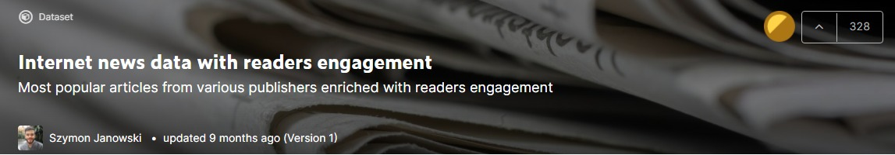

# Analyzing and Predicting Consumer Engagement 
In this project, we will be using [Internet News and Consumer Engagement dataset](https://www.kaggle.com/szymonjanowski/internet-articles-data-with-users-engagement) from Kaggle to predict top article and popularity score. We will be exploring our data to discover patterns, such as correlation, distribution, mean, and time series analysis. We will use both text regression and text classification models to predict engagement score and top article based on the title. 

Photo by <a href="https://unsplash.com/@thenewmalcolm?utm_source=unsplash&utm_medium=referral&utm_content=creditCopyText">Obi Onyeador</a> on <a href="https://unsplash.com/s/photos/news?utm_source=unsplash&utm_medium=referral&utm_content=creditCopyText">Unsplash</a>
  
# Introduction
Text classification is common among the application that we use on daily basis. For example, email providers use text classification to filter out spam emails from your inbox. The other most common use of text classification is in customer care where they use sentimental analysis to differentiate bad reviews from good reviews [ADDI AI 2050](https://medium.com/r/?url=https%3A%2F%2Faddiai.com%2Ftext-classification%2F). We are going to train our model on titles so that it can predict where the article is top or not. Text Regression is similar where we take text vectorized data and predict popularity score which is a decimal value.

> **Our key focus will be on an article title and how it affects other features.** 

## DataSet

This dataset ([source](https://www.kaggle.com/szymonjanowski/internet-articles-data-with-users-engagement)) consists of data about news articles collected from Sept. 3, 2019 until Oct. 4, 2019. Afterwards, it is enriched by Facebook engagement data, such as number of shares, comments and reactions. 

- **Source*id*** column value indicates publisher unique identifier usually presented as lowercase sourcename with spaces replaced with underscore symbol.
- **Source_name** column value indicates publisher name.
- **Author** column value indicates article author. Some publishers do not share information about authors of their news, in this case usually source_name replaces that information.
- **Title** column value indicates headline of an article.
- **Description** column value indicates short article description usually visible in popups or recommendation boxes on the publisher's website. This field is shortened to a few sentences content column.
- **Url** column value indicates URL (Uniform Resource Locator) for article located on the publisher website.
- **Url*to*image** column value indicates a URL to the main image associated with the article.
- **Published_at** column value indicates the exact date and time of publishing the article. Date and time are presented in UTC (+000) time format.
- **Content** column value indicates the unformatted content of the article. This field is truncated to 260 characters.
- **Top_article** column value indicates article listed as a top article on publisher website. This field can have only two values, 1 when the article is contained in the popular/top articles group and 0 otherwise.

## This Notebook is Part of the DataCamp Competition.

  
